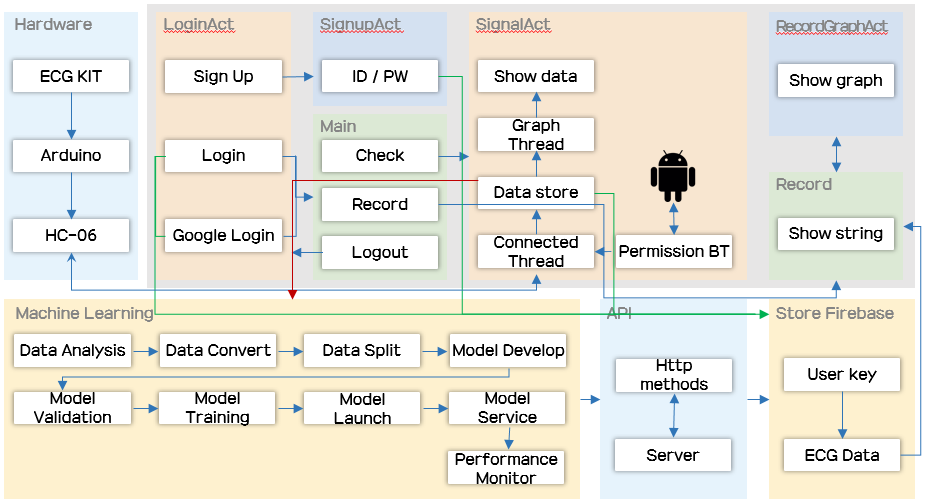
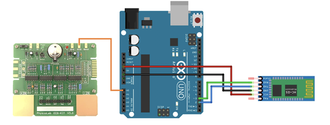
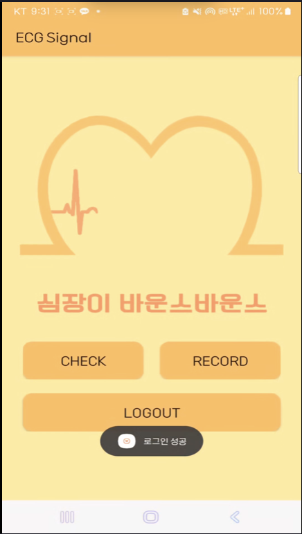
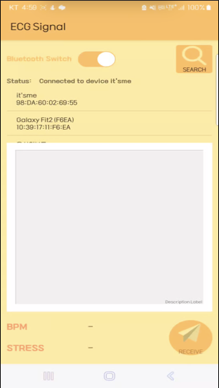

# Basic mobile lab

## 개요
이 프로젝트는 모바일 어플리케이션을 통해 사용자의 심전도(ECG) 신호를 실시간으로 측정 및 출력하는 것을 목표로 합니다.  
아두이노와 ECG KIT, 그리고 안드로이드 스튜디오를 활용하여 사용자가 심박 변화를 쉽게 확인할 수 있도록 지원하며, 데이터 분석 및 머신러닝 모델을 통해 이상 징후를 감지할 수 있습니다.

<!-- 시스템 구성도 이미지 (예: 다이어그램) -->

## 주요 특징
- **실시간 ECG 시그널 출력:**  
  아두이노에서 처리한 ECG 데이터를 블루투스를 통해 안드로이드 앱으로 전송, 실시간 그래프로 시각화합니다.
- **월별 심전도 데이터 제공:**  
  사용자의 심전도 데이터를 월별로 기록하여 최대, 최소, 평균 심박수를 확인할 수 있습니다.
- **데이터 분석 및 이상 감지:**  
  기존 데이터셋(WESAD)을 활용한 머신러닝 분석으로 사용자의 상태(스트레스 유무)를 판단합니다.
- **비용 및 시간 절감:**  
  모바일 기기를 활용하여 병원 방문 없이 심전도 검사를 진행할 수 있습니다.

## 팀 구성
- **팀 구성:**  
  - 손보경 (조장, 프론트엔드, 문서 작업)  
  - 손지운, 임석민 (아두이노 및 ECG KIT, 블루투스 연결, 테스트)  
  - 윤덕용 (데이터베이스)  
  - 이영주 (데이터 분석, 아두이노)  

## 시스템 구성 및 설계
### 기능 요구사항
- **초기화면:**  
  블루투스 연결 확인 후, 아두이노와의 통신을 시작합니다.
- **ECG 시그널 출력:**  
  아두이노에서 처리된 ECG 시그널을 안드로이드 앱에서 실시간 그래프로 출력하며, BPM, 최대/최소 심박수 등의 정보를 제공합니다.
- **데이터 테이블:**  
  월별 심전도 데이터(최대, 최소, 평균 심박수 등)를 테이블 형식으로 제공하여 사용자가 쉽게 확인할 수 있습니다.
- **머신러닝 기반 상태 판별:**  
  기존 데이터셋을 활용해 사용자의 심전도 데이터와 비교, 이상 징후 발생 시 경고 메시지를 출력합니다.

### 개발 환경 및 기술 스택
- **Android Studio:**  
  안드로이드 앱 개발 (Java/Kotlin, XML)
- **Arduino IDE:**  
  아두이노 보드 프로그래밍 (C/C++), ECG KIT 및 HC-06 블루투스 모듈 연결
- **Firebase:**  
  실시간 데이터베이스 연동 및 데이터 저장
- **Jupyter Notebook:**  
  데이터 전처리 및 분석 (Python, Pandas, Numpy)
- **기타 하드웨어:**  
  ECG KIT, 블루투스 모듈 등

### 프론트엔드 및 백엔드 설계
- **프론트엔드:**  
  - 사용자 인터페이스를 통해 심전도 시그널 확인 및 월별 데이터 조회 기능 제공  
  - 실시간 차트(예: MPAndroidChart 라이브러리 사용)를 통한 데이터 시각화  
  - 블루투스 연결 및 데이터 수신 관련 코드 구현
- **백엔드:**  
  - Firebase를 이용해 심전도 데이터를 날짜별로 저장 및 관리  
  - 데이터베이스에 저장된 데이터를 기반으로 분석 및 머신러닝 모델에 활용

### 머신러닝 모델 및 데이터 분석
- **HRV(Heart Rate Variability) 분석:**  
  - 심박 간격(RR interval)을 분석하여 SDRR, RMSSD 등의 지표를 산출  
  - 주파수 영역 분석을 통해 LF, HF, 그리고 정규화 지표(nLF, nHF)를 활용
- **데이터셋 및 모델:**  
  - 공개 데이터셋: WESAD 데이터셋 (ECG 데이터 활용)  
  - 모델: 이진 분류(스트레스 vs. 비스트레스) 또는 다중 분류 (XGBoost, LightGBM, DecisionTree 등)  
  - 데이터 전처리: PWM 데이터를 푸리에 변환하여 700Hz 샘플링 데이터를 생성

## 설치 및 실행 방법
### 1. 아두이노 설정
- Arduino IDE를 설치 후, 제공된 스케치를 업로드합니다.
- ECG KIT 및 HC-06 블루투스 모듈을 아두이노에 올바르게 연결하고 핀 설정을 확인합니다.
- **하드웨어 연결 사진:**  
  

### 2. 안드로이드 앱 설정
- Android Studio에서 프로젝트를 열고, 필요한 권한(예: `BLUETOOTH`, `BLUETOOTH_ADMIN`)을 AndroidManifest.xml에 추가합니다.
- 블루투스 연결 및 데이터 수신 관련 코드를 컴파일 후 실행합니다.
- **앱 UI 스크린샷:**  
  

### 3. Firebase 연동
- Firebase에서 프로젝트를 생성하고 실시간 데이터베이스를 설정합니다.
- Android Studio 프로젝트와 Firebase를 연동하여 심전도 데이터를 실시간으로 저장 및 관리합니다.

### 4. 머신러닝 모델 학습 (선택 사항)
- Jupyter Notebook 환경에서 데이터 전처리 및 분석을 진행합니다.
- WESAD 데이터셋을 활용하여 모델을 학습시키고, 필요 시 앱과 연동하여 상태 판별 기능을 구현합니다.

## 데모 영상
프로젝트의 그래프 출력 동작 과정을 보여주는 데모 영상을 아래 링크에서 확인할 수 있습니다.  

